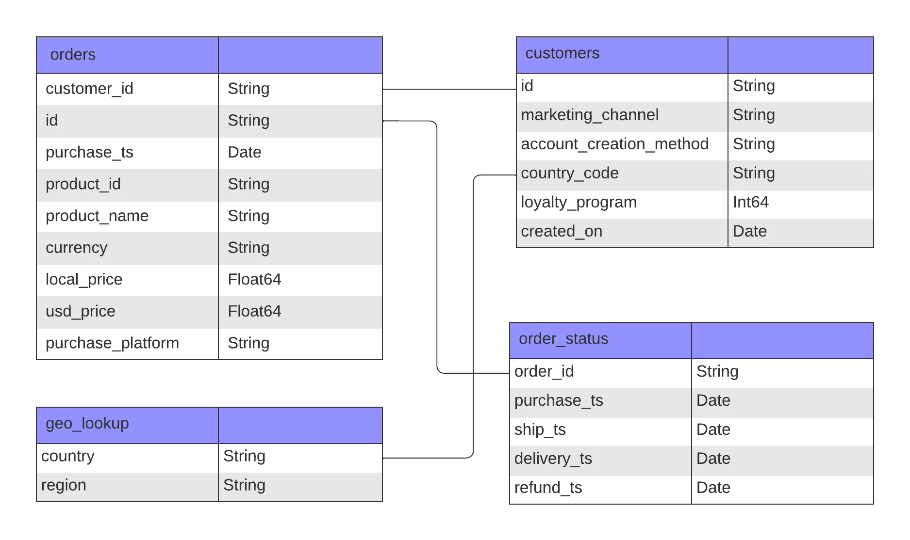
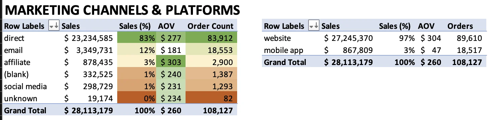
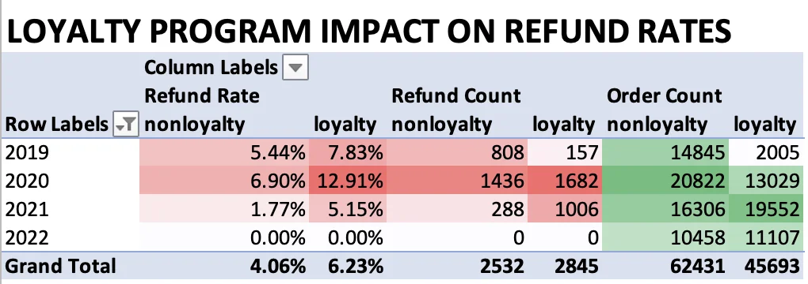

# ByteX Post-Pandemic Analysis

> For more of my projects and data journey, visit my [Portfolio](https://ruizdelcarmen.me/).

Table of Contents

- [Project Background](#project-background)
- [Executive Summary](#executive-summary)
- [Insights Deep-Dive](#insights-deep-dive)
    - [Sales Trends and Growth Rates](#sales-trends-and-growth-rates)
    - [Key Product Performance](#key-product-performance)
    - [Customer Growth and Repeat Purchase Trends](#customer-growth-and-repeat-purchase-trends)
    - [Loyalty Program Performance](#loyalty-program-performance)
    - [Sales by Platforms & Channels](#sales-by-platforms--channels)
    - [Refund Rate Trends](#refund-rate-trends)
- [Actionable Recommendations](#actionable-recommendations)
    - [Maximizing Product Offerings](#maximizing-product-offerings)
    - [Customer Growth and Retention Strategies](#customer-growth-and-retention-strategies)
    - [Loyalty Program Enhancements](#loyalty-program-enhancements)
    - [Maintaining Low Refund Rates](#maintaining-low-refund-rates)
    - [Optimizing Channels and Platforms](#optimizing-channels-and-platforms)
    - [Regional Growth Strategies](#regional-growth-strategies)
- [Assumptions and Caveats](#assumptions-and-caveats)

## Project Background

ByteX, a global e-commerce company founded in 2018, specializes in selling popular electronics like Apple, Samsung, and ThinkPad products. I'm partnering with the Head of Operations to extract insights and deliver recommendations to improve performance across sales, product, and marketing teams.

## Executive Summary

This analysis of 108,000 ByteX orders from 2019 to 2022 reveals key trends to inform strategic actions post-pandemic. ByteX averaged $7 million in annual sales, with a sharp 2020 pandemic surge, followed by a 45% decline by 2022, stabilizing above pre-pandemic levels. North America and EMEA remain the strongest markets, contributing 80% of sales, while APAC and LATAM showed volatility despite rapid growth in 2020. Laptop sales, particularly MacBooks and ThinkPads, surged during the pandemic but have since slowed. The loyalty program has boosted customer engagement and revenue but has lost momentum post-pandemic.

To maintain growth, ByteX should focus on expanding its top-performing products, optimizing the loyalty program, and prioritizing North America and EMEA. Additional opportunities include stabilizing APAC and LATAM markets, improving refund rates, and expanding affiliate marketing.

ByteX Dataset ERD

## Insights Deep-Dive

### Sales Trends and Growth Rates

- ByteX averages $7 million in annual sales with 27,000 orders per year.
- Sales surged in 2020 due to the pandemic but declined by 45% by 2022, returning to just above pre-pandemic levels as physical stores reopened.
- ByteX shows seasonality, with peak sales in November and December and lower sales in February and October.
- North America and EMEA contribute 80% of sales, with the U.S. alone accounting for 50%.
- APAC and LATAM experienced an astounding +200% growth in 2020 but have remained volatile.

### Key Product Performance

- During the pandemic, laptop sales soared, with MacBook orders increasing by 400% and ThinkPad by 220%. This trend has since reversed post-pandemic.
- Four products: monitors, AirPods, laptops, and Samsung Cable Pack, generate 96% of total revenue.
- AirPods account for 45% of all orders ($7.7M revenue).
- Monitors lead in revenue, contributing $9.8 million (35% of total sales) from 2019 to 2022.
- Samsung Cable Pack represents 20% of orders but only 2% of revenue, likely due to its low price or use in promotions.

### Customer Growth and Repeat Purchase Trends

- ByteX’s unique customers grew steadily from 2019 to 2021, peaking at nearly 30,000 in 2021, but declined sharply by nearly 40% in 2022.
- Repeat purchase rates (≥2 orders) consistently decreased, from 20.22% in 2019 to 14.76% in 2022, indicating challenges in retaining customers after initial purchases. Insights into the behaviors of ByteX’s core repeat customer group (avg. 4k unique customers) could reveal patterns to help drive repeat purchases more broadly.
- The stability in the number of repeat customers suggests a core base of loyal customers who consistently make multiple purchases each year.
- The decline in both unique and repeat customers in 2022 highlights potential shifts in market dynamics or customer preferences. This trend suggests an opportunity to refine customer retention and loyalty strategies to reverse these declining metrics and boost overall customer lifetime value.

### Loyalty Program Performance

- Loyalty members make their first purchase 20 days earlier (30% less time) than non-loyalty members (50 days vs. 70 days).
- Post-pandemic, loyalty metrics surged but began slowing by 2022.
- Loyalty members now lead in key metrics, generating $500K more in revenue, spending $30 more per order, and placing 500K more orders than non-loyalty members.
- The loyalty program performs strongly in North America, while APAC and LATAM regions remain volatile, suggesting a need for targeted strategies.
- Loyalty purchases have a higher refund rate than non-loyalty purchases.

### Sales by Platforms & Channels

- Direct channel account for 83% ($23M) of ByteX's sales.
- Social media contributes 1% of sales, and affiliate channels contribute 3% ($878K).
- Affiliate channels have the highest average order value (AOV) at $303, while email campaigns have the lowest AOV at $181.
- The website generates 97% ($27M) of sales with an AOV of $304, whereas the mobile app ($867K) lags with an AOV of $47.
- Further considerations on channel performance are detailed in the assumptions and caveats section.

### Refund Rate Trends

- Refund rates for high-ticket items peaked early in the pandemic but have since stabilized at 4-6%.
- In 2021, refunds decreased across all products compared to the the previous two years.
- Laptops had the highest refund rates in 2019 and 2020 (17%) but have since dropped to 6-9%, aligning with other product categories.
- Apple Airpods Headphones have the highest refund count at 2.6K (5% refund rate).
- Loyalty purchases exhibit a higher refund rate than non-loyalty purchases, potentially warranting further investigation.

## Actionable Recommendations

### Maximizing Product Offerings

Monitors, AirPods, and laptops dominate sales and perform consistently across all regions.
- **Recommendation**: Expand catalogue variations in these categories to meet diverse customer needs, such as different premium models, to drive repeat purchases and strengthen market presence.

The Samsung Cable Pack makes up 20% of orders but only 2% of revenue, highlighting an opportunity for optimization.
- **Recommendation**: Reevaluate pricing, bundle with high-value items, or offer as a promotional gift to boost average order value (AOV).

### Customer Growth and Retention Strategies

The repeat purchase rate has shown a steady decline, with a notable drop in 2022. Strengthening the loyalty program and re-engaging single-purchase customers are key to expanding the repeat customer base.
- **Recommendation**: Increase repeat purchase rates by targeting single-purchase customers with personalized re-engagement campaigns. Introducing tiered rewards within the loyalty program can further incentivize frequent purchases and improve customer retention.

The sharp drop in unique customers in 2022 suggests a need to revamp acquisition strategies to regain growth momentum.
- **Recommendation**: Revitalize the acquisition approach by expanding into new channels, such as social media and influencer/affiliate partnerships, and refine ByteX’s messaging to attract and re-engage past customers.

The stability in the repeat customer base presents an opportunity to leverage insights from this group to gain understanding of customer preferences and behaviors.
- **Recommendation**: Analyze the behaviors and preferences of this core group to inform loyalty-focused campaigns and improve our customer growth and retention. Offer referral incentives to encourage word-of-mouth growth, helping to increase acquisition from existing customer networks.

### Loyalty Program Enhancements

While ByteX attracts new buyers, loyalty member conversion has been inconsistent and relevant metrics trend downwards in program performance near the end of 2022 onwards.

- **Recommendation**: Use targeted onboarding campaigns offering first-purchase discounts or early access. Tiered rewards can incentivize frequent purchases and improve retention. **Continuously monitor these metrics before making any final decisions on the program’s future, allowing for data-driven refinements.**

### Maintaining Low Refund Rates

In 2021, refund rates dropped significantly, aligning with customer expectations.

- **Recommendation**: Replicate successful practices from that period; product descriptions, quality control, or post-purchase support to maintain this trend.

### Optimizing Channels and Platforms

Affiliate marketing offers high AOV but accounts for only 3% of sales, holding untapped potential.
- **Recommendation**: Expand affiliate partnerships or increase commissions to attract influential marketers, boosting brand reach and AOV.

The website remains the highest-grossing sales channel, but the mobile app lags behind.
- **Recommendation**:  If resources permit, improve the mobile app experience by simplifying checkout, personalizing the experience. With mobile usage trends increasing, these adjustments could increase its contribution to total sales.

### Regional Growth Strategies

North America and EMEA generate 80% of sales, making them critical markets for sustained growth. However, regions like APAC and LATAM show potential despite their volatility.

- **Recommendations**:
    - Continue to focus resources on North America and EMEA through regionalized marketing campaigns and ensure product availability aligns with local consumer preferences.
    - For APAC and LATAM, consider leveraging localized partnerships or promotions that speak to the cultural and economic conditions of each region. These markets may require more tailored approaches, but with the right strategies, ByteX can capture their growth potential and stabilize sales performance.

 Assumptions and Caveats 

## Assumptions and Caveats
> Key questions to relevant teams for further clarity before project progression and decision-making.

- **Refund Records**: No refunds were recorded for 2022, which is an anomaly that may require further examination.
- **Deterministic Relationship in Data**: There is a one-to-one mapping between `marketing_channel` and `account_creation_method`, with each channel exclusively tied to a single method.  This lack of variation may need attention from the data engineering team.
    - 
- **Loyalty Program Clarification**: The relationship between the `loyalty_program` variable and individual order records is unclear. Specifically:
  - Is `loyalty_program` linked to the user's account, or is it order-specific?
  - Can a user be a loyalty member for one purchase and not another? This detail is critical for accurately measuring loyalty program performance.
- **Sales and Marketing Channels**: Direct and email marketing channels drive most sales, though their direct connection to the loyalty program remains unclear due to the deterministic nature of *channel*, *account*, and *order* relationships.
    - **Initial Point of Contact Leading to Purchases**: Each purchase should ideally be attributed to the marketing channel that directly led to it, rather than defaulting all future purchases to a customer's initial channel (e.g., Customer A comes through email for one purchase and social media for the next). This approach provides a clearer view of each channel's effectiveness in driving sales over time. That is not the case in this dataset
    - Given the assumption that it is the user's entry point at time of account creation rather than order placement (which is not the best practice in the context of ecommerce transactions) these are useful insights:
        - The email channel has the highest loyalty membership rate at 58%.
        - The direct channel has the largest loyalty member count, comprising 32,906 members (72% of all loyalty members).
        - These metrics could inform which channels to emphasize for enhancing loyalty program engagement.
- **Unmatched Customers in `orders` vs `customers` table**: There are 27k (25%) transaction records whose `customer_id` is not present in the `customers` table. This discrepancy may indicate missing customer data or errors in data collection, requiring further investigation. This will directly affect SQL queries when joining on the `customer_id`, and will result in these records to have NULLs in any of the attributes from the `customers` table.
    - This point is mainly due to the dataset table structure in the SQL database, where tables are segmented by `orders`, `customers`, `geo_lookup`, and `order_status`. This segmentation revealed the mismatch in data. Working with the Excel data, since the dataset is in a singular table, this issue is not present since all the data is in one place.
    - With this, a valuable clarifying question is to ask the stakeholder which table to source the `customer_id` from because of this discrepancy. This will ensure that the data is consistent across all tables and that the analysis is.

### Key Columns for Further Clarification with Relevant Teams:

- `marketing_channel` and `account_creation_method` in the `customers` table
    - How is this recorded and what does it represent exactly in the context of the data? 
    - What factors drive the deterministic relationship between them?
    - Is the marketing channel the initial touchpoint before account creation OR the point of origin that led to an individual purchase was made (which is a far more useful metric)?
- `loyalty_program` in the `customers` table
    - Is this variable account-specific or tied to individual orders?
    - Can membership status vary between orders for the same user? (Is the loyalty program a subscription or a one-time sign-up?)

***

- See the raw data and my cleaning, analysis, and pivot tables in the [Excel workbook](Exploration/bytex_ecommerce_analysis.xlsx).
- See my SQL queries in the [SQL file](Exploration/ecommerce_exploration.sql).
- See the notebook for data cleaning, visualization, and analysis in the [Python Notebook](Exploration/ecommerce_analysis.ipynb).
- For more of my projects and data journey, visit my [portfolio website and reach out](https://ruizdelcarmen.me/)!
